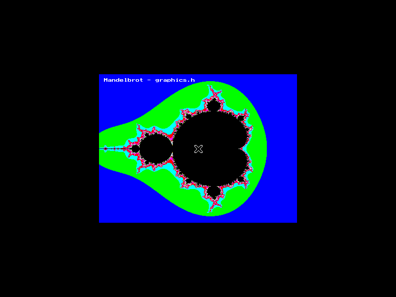
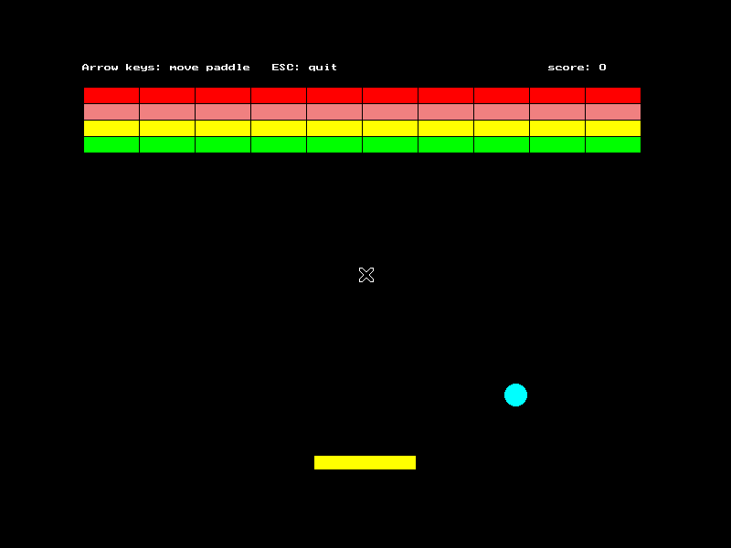
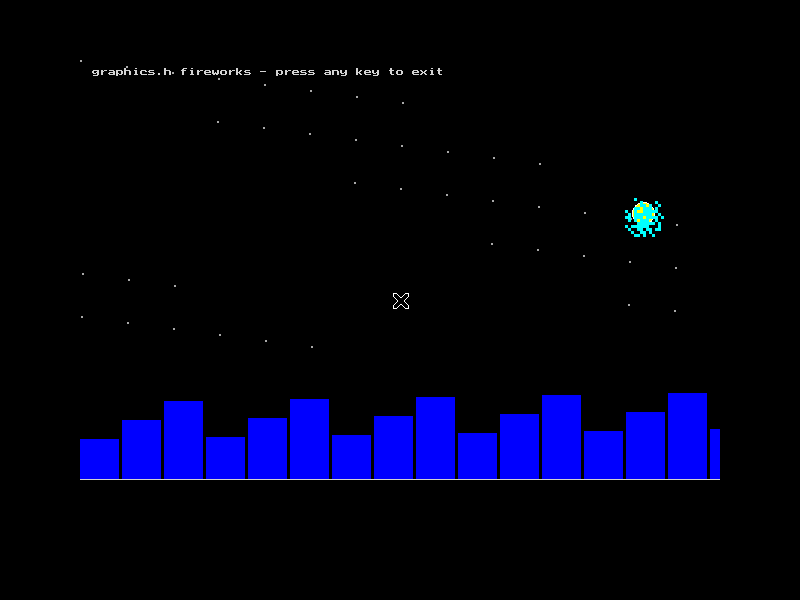

<p align="center">
  
</p>
<h3 align="center">Powered by Department of CSE, <a href="https://www.diu.ac.bd/">Dhaka International University</a>, Bangladesh</h3>

---

# graphics.h Runner — BGI C++ Graphics Toolkit for VS Code

[](CHANGELOG.md)
[](LICENSE)
[](#per-os-setup)
[](#tested--verified)

**Compile & run C++ programs that use `graphics.h` (BGI / WinBGIM / SDL_bgi) with one keypress.**
One command sets up the whole toolchain from zero — compiler guidance, graphics library
download/build/patch/install — no admin rights needed for the graphics library, no manual
flag memorizing, ever.

```cpp
#include <graphics.h>

int main ( ) {
    initwindow(640, 480);
    setcolor(YELLOW);
    setfillstyle(SOLID_FILL, RED);
    bar(80, 80, 280, 200);
    outtextxy(200, 300, (char*)"Hello, graphics.h!");
    getch();
    closegraph();
    return 0;
}
```

Press **`Ctrl+Alt+R`** → compiled with the right linker flags → graphics window opens.

---

## Features

| Feature | What it does |
|---|---|
| **⚡ Complete graphics.h Run Setup** | One command bootstraps **everything** — including the C++ compiler itself on Windows (winget auto-install, or a sha256-verified direct download fallback; per-user, **no admin rights**) — then installs WinBGIM/SDL_bgi automatically (download → patch → build → install → paths wired into settings) and re-verifies the whole toolchain live. System packages that need a password are handed to the terminal as copy-paste commands. |
| **🎨 Modern webpage-style panel (Activity Bar)** | The graphics.h icon opens a styled dashboard, not a plain tree: gradient hero with the DIU logo, a live **environment card** (Ready / Not ready / Checking) with a one-click **Complete Run Setup** fix while anything is missing, an action grid, and **18 emoji program cards** — each with **▶ Run** (open + compile + launch in one click) and **Open** buttons. Responsive for narrow sidebars; identical look in light & dark themes. |
| **🩺 Setup Doctor** | Probes your compiler and *every* candidate graphics library by actually compiling a `graphics.h` probe. Reports exactly what is missing with per-OS fixes, and offers **Fix automatically**. |
| **🔍 graphics.h auto-detect** | When `#include <graphics.h>` is present, BGI linker flags are applied automatically. Files without it still compile as plain C++. |
| **▶️ Compile & Run — 4 ways** | `Ctrl+Alt+R` (compile & run), `Ctrl+Alt+B` (compile), the editor **▶ run-button dropdown** (right beside the C/C++ "Run C++ File" entry), and **F5 → "Run graphics.h program"** via a built-in run-only debug adapter. |
| **🧰 Per-OS linker recipes** | Windows (WinBGIM): `-lbgi -lgdi32 -lcomdlg32 -luuid -loleaut32 -lole32` + static linking. Linux (SDL_bgi): `-lSDL_bgi -lSDL2 -lm`, or libgraph: `-lgraph`. macOS: SDL_bgi via Homebrew SDL2. Custom library prefixes get matching `-Wl,-rpath` automatically. |
| **📊 Status bar indicator** | `✓ graphics.h` / `⚠ graphics.h` / `? graphics.h` at a glance. Click to run the Setup Doctor. |
| **🛡️ Messy-settings healing** | Real-world PCs have messy configs. The extension heals them on every run: quoted paths (`"C:\...\g++.exe"`), `%ENV%`/`$VAR` variables, `~`, trailing slashes, **directory-instead-of-exe** paths, missing `.exe` suffixes, stale include/lib dirs from old installs (auto-pruned), and Windows' raw `-4058` spawn failures are all recognized and routed to the one-click fix instead of cryptic errors. |
| **✂️ Snippets** | `gfxprog`, `gfx-anim`, `gfx-mouse`, `gfx-kbd`, `gfx-text`, `gfx-bar`. |
| **🎮 18 example programs** | Classic starters plus fun ones: Winking Smiley, Bouncing Balls, Fireworks, Solar System, Aquarium, Rainbow Spiral, Helicopter, Sunset Scene, Warp Starfield — all auto-exiting and screenshot-verified. |

## Install

**From the VS Code Marketplace (recommended):** search for **"graphics.h Runner"** in the
Extensions view (`Ctrl+Shift+X`), or from the command line:

```bash
code --install-extension mythos0-labs.graphics-h-runner
```

**From a GitHub release:** download `graphics-h-runner-1.4.3.vsix` from
[Releases](../../releases), then in VS Code: `Extensions view → ⋯ → Install from VSIX…`
(or `code --install-extension graphics-h-runner-1.4.3.vsix`).

**From source:**

```bash
git clone https://github.com/mythos0/graphics-h-runner.git
cd graphics-h-runner
npm install && npm run compile
npx @vscode/vsce package --no-dependencies
code --install-extension graphics-h-runner-*.vsix
```

## From zero to running (60 seconds)

1. Open the Command Palette → **`graphics.h: Complete graphics.h Run Setup`**.
2. Watch it work:
   - **Windows** — installs MinGW-w64 g++ via `winget` (manual WinLibs fallback provided), then
     downloads `graphics.h`, `winbgim.h`, `libbgi.a` into the extension folder and wires the paths.
     No copying into MinGW directories, no admin rights.
   - **Linux** — prints one copy-paste command for the system packages (`build-essential`,
     `libsdl2-dev` — password prompts work in the terminal), then **automatically** downloads,
     patches (two known upstream header fixes + screen-presentation fix), builds and installs
     SDL_bgi into `~/.graphics-h-runner/` — **no sudo needed for the library** — and wires
     include/lib/rpath into the extension settings.
   - **macOS** — `xcode-select` / `brew install sdl2` guidance, then the same automatic
     user-prefix SDL_bgi build.
3. When it says **VERIFIED: graphics.h is ready**, open any `.cpp` with `<graphics.h>` and press
   `Ctrl+Alt+R`.

## Commands & keybindings

| Command | Key | Description |
|---|---|---|
| `graphics.h: Compile & Run` | `Ctrl+Alt+R` | Compile (with BGI flags when needed) and run |
| `graphics.h: Compile` | `Ctrl+Alt+B` | Compile only |
| `graphics.h: Run Last Build` | — | Run the previously built binary |
| `graphics.h: Stop Running Program` | — | Kill the last launched graphics window |
| `graphics.h: Setup Doctor` | — | Probe compiler + libraries, offer fixes |
| `graphics.h: Complete graphics.h Run Setup` | — | The 0 → running bootstrap (compiler included) |
| `graphics.h: Copy Compile Command` | — | Copy the exact compiler command line for the active file |
| `graphics.h: Open Examples Folder` | — | Copy all 18 examples into the workspace and reveal them |
| `graphics.h: Open Example Program` | — | Open any bundled sample as `filename.cpp` (panel) |
| *F5 / Run and Debug* | `F5` | **Run graphics.h program** — compile & launch the active file |

### The activity-bar panel

The **graphics.h Runner** icon in the Activity Bar opens the modern panel:

1. **Hero + live status** — DIU branding and a Ready / Not ready / Checking pill;
   while anything is missing, a one-click **🚀 Complete Run Setup** button appears.
2. **Actions grid** — Compile & Run, Complete Run Setup, Setup Doctor, Compile,
   Run Last Build, Stop Running Program, Copy Compile Command, Open Examples Folder.
3. **Example Programs** — 18 emoji cards (tagged `classic`/`fun`/`math`/`interactive`).
   **▶ Run** opens the file, compiles and launches the graphics window in one click;
   **Open** just opens the source as `graphics-h-programs/<name>.cpp`.

## Extension settings

| Setting | Default | Description |
|---|---|---|
| `graphics-h-runner.compilerPath` | `g++` | Compiler executable (full path for MinGW if not on PATH) |
| `graphics-h-runner.autoDetect` | `true` | Apply BGI flags only when `graphics.h` is detected |
| `graphics-h-runner.linuxLibrary` | `auto` | `auto` / `sdl_bgi` / `libgraph` |
| `graphics-h-runner.staticLinkWindows` | `true` | `-static-libgcc -static-libstdc++` on Windows |
| `graphics-h-runner.extraIncludePaths` | `[]` | Extra `-I` dirs (auto-managed by Full Setup) |
| `graphics-h-runner.extraLibPaths` | `[]` | Extra `-L` dirs (auto-managed by Full Setup) |
| `graphics-h-runner.extraCompilerArgs` | `[]` | e.g. `["-std=c++17", "-Wall"]` |
| `graphics-h-runner.showStatusBarItem` | `true` | Show the BGI status indicator |

## Telemetry (automatic error collection)

This extension collects **crash and error reports automatically** through
[Sentry](https://sentry.io) so setup failures on any PC can be found and fixed
without asking anyone to copy-paste logs. What this means in practice:

- **Consent first** — nothing is ever sent unless VS Code telemetry is enabled
  (`Settings → Telemetry → Telemetry Level` is not `Off`). Toggling that setting
  enables or disables collection immediately; there is no separate opt-in.
- **What is collected** — uncaught exceptions and unhandled rejections, plus
  context that makes them diagnosable: stack traces, breadcrumbs (e.g. “compile
  failed”, “Complete Setup step: install-winbgim”), and tags such as OS, CPU
  architecture, VS Code version and the detected graphics library.
- **What is never collected** — your source code, file contents, compiler
  output, file names from outside the breadcrumbs above, or anything you type.
  User-identifying path segments (`C:\Users\<name>`, `/home/<name>`) are
  scrubbed from every event before it leaves your machine.

## Tested & verified

Every sample below was compiled with the extension's exact flag-building code
(`out/buildArgs.js`), executed on a virtual display (Xvfb) and **screenshot-verified** by an
automated pipeline (`test/run-tests.js`, results in `test/test-results.json`):

| Sample | Verdict | Rendered content |
|---|---|---|
| `01_hello_graphics.cpp` | ✅ PASS (clean self-exit, exit 0) | shapes + text |
| `02_shapes_showcase.cpp` | ✅ PASS | bars, circles, ellipses, flood fill, 16-color palette |
| `03_bouncing_ball.cpp` | ✅ PASS | animated ball with trail |
| `04_moving_car.cpp` | ✅ PASS | scrolling road scene |
| `05_tricolor_flag.cpp` | ✅ PASS | flag with sun emblem (52% coverage) |
| `06_fractal_tree.cpp` | ✅ PASS | recursive fractal tree |
| `07_mandelbrot.cpp` | ✅ PASS | full Mandelbrot set, 120k putpixels |
| `08_mouse_paint.cpp` | ✅ PASS | mouse painting + color cycling |
| `09_keyboard_paddle.cpp` | ✅ PASS | paddle game with keyboard control |
| `10_smiley_wink.cpp` | ✅ PASS | bobbing smiley that winks + hearts |
| `11_bouncing_balls.cpp` | ✅ PASS | 7 colorful balls with ghost trails |
| `12_fireworks.cpp` | ✅ PASS | rockets + particle bursts over a city |
| `13_solar_system.cpp` | ✅ PASS | orbiting planets, moon, comet |
| `14_aquarium.cpp` | ✅ PASS | fish, bubbles, swaying seaweed (63% coverage) |
| `15_rainbow_spiral.cpp` | ✅ PASS | growing rainbow spiral |
| `16_helicopter.cpp` | ✅ PASS | heli over night skyline, spinning rotor |
| `17_sunset.cpp` | ✅ PASS | sun sets, stars + moon rise, lighthouse (60% coverage) |
| `18_starfield.cpp` | ✅ PASS | warp-speed starfield streaks |

Screenshots: [`docs/screenshots/`](docs/screenshots/) — e.g. the Mandelbrot render:







A **frame-tearing bug in the bundled SDL_bgi presentation path** was found by the screenshot
analyzer during testing (frames captured mid-draw showed bricks without the paddle/ball) and
fixed in the library build the Setup Engine produces: presentation is now event-driven — one
full-frame present per `delay()`/`kbhit()`/`getch()` call instead of one per drawing primitive.

The **setup engine** is tested end-to-end as well: fresh SDL_bgi download → patch → build →
user-prefix install → compile → verified render, plus WinBGIM asset validation
(`scripts/test_setup_engine.js` in the dev workspace).

## Per-OS setup (what Complete Setup automates)

### Windows
1. **Compiler — now fully automatic**: Complete Setup runs
   `winget install -e --id BrechtSanders.WinLibs.POSIX.UCRT` for you (per-user portable install,
   no admin prompt), then finds the new `g++.exe` and wires it into `graphics-h-runner.compilerPath`.
   No winget? It downloads the WinLibs UCRT zip directly (sha256-verified) into the extension
   folder and extracts it with built-in PowerShell — still no admin rights. Missing compiler on
   run? You get a one-click **"Complete Run Setup"** prompt. Manual route: [winlibs.com](https://winlibs.com/).
2. **WinBGIM** — Complete Setup downloads it into the extension folder automatically. Manual route:
   copy `graphics.h` + `winbgim.h` into `<MinGW>\include` and `libbgi.a` into `<MinGW>\lib`.
3. The extension compiles with:
   `g++ main.cpp -o main.exe -static -lbgi -lgdi32 -lcomdlg32 -luuid -loleaut32 -lole32 -static-libgcc -static-libstdc++`
   (fully statically linked — the `.exe` runs on any Windows 10/11 machine, no DLL hunting).

### Linux
1. `sudo apt install build-essential libsdl2-dev` (or `dnf`/`pacman` equivalents — Complete Setup
   detects your package manager).
2. **SDL_bgi** — Complete Setup downloads it, applies the compatibility patches, builds and installs
   it into `~/.graphics-h-runner/usr/` automatically (no sudo). Manual route: build from
   [sourceforge.net/projects/sdl-bgi](https://sourceforge.net/projects/sdl-bgi/) with
   `make && sudo make install`.
3. The extension compiles with: `g++ main.cpp -o main -lSDL_bgi -lSDL2 -lm`
4. *Tip:* if your own SDL_bgi 3.x build shows a black window, that is the upstream "fast mode"
   presentation quirk — set `SDL_BGI_RATE=auto` or call `refresh()` after drawing. Complete
   Setup's build has this fixed automatically.

### macOS
1. `xcode-select --install` then `brew install sdl2`.
2. SDL_bgi — same automatic user-prefix build as Linux.

## Troubleshooting

- **"could not run g++"** — install a compiler (see per-OS above) or set
  `graphics-h-runner.compilerPath` to its full path.
- **Doctor says a library probe failed** — read the printed fix, or click **Fix automatically**.
- **Compiled but the window is black on a self-installed SDL_bgi 3.x** — set
  `SDL_BGI_RATE=auto`, or re-run Complete Setup so the patched build is installed for you.
- **Windows: `winget` missing** — use the WinLibs manual download shown by Complete Setup.

## Publishing notes (for maintainers)

Publishing is fully automated from GitHub:

- **Tag a release** — push a `vX.Y.Z` tag → [`.github/workflows/release.yml`](.github/workflows/release.yml)
  runs smoke tests, packages the .vsix, publishes to the VS Code Marketplace and creates a GitHub
  Release with the asset.
- **Bump the version on main** — [`.github/workflows/auto-publish.yml`](.github/workflows/auto-publish.yml)
  detects the `package.json` version change on every push to `main`, and if it changed: builds,
  publishes to the Marketplace, tags `vX.Y.Z` and creates the GitHub Release automatically.
- Both need one repository secret: **`VSCE_PAT`** — an Azure DevOps PAT with
  *Organization: all accessible organizations* and *Scopes: Marketplace → Manage*
  (create at dev.azure.com → User settings → Personal access tokens).
- Marketplace listing page: <https://marketplace.visualstudio.com/items?itemName=mythos0-labs.graphics-h-runner>
- OpenVSX (optional): `npx ovsx publish --pat $OPEN_VSX_TOKEN`.

## License

[MIT](LICENSE) — © 2026 MYTHOS0
