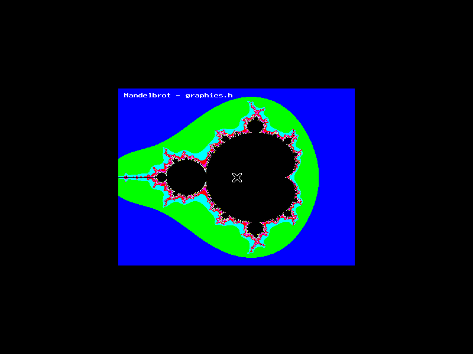
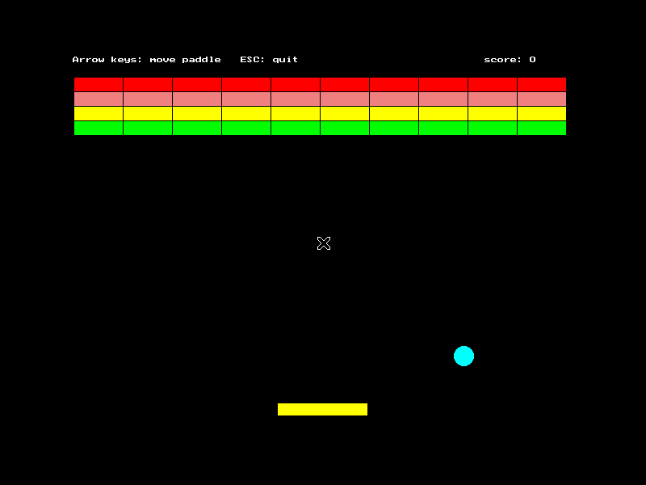
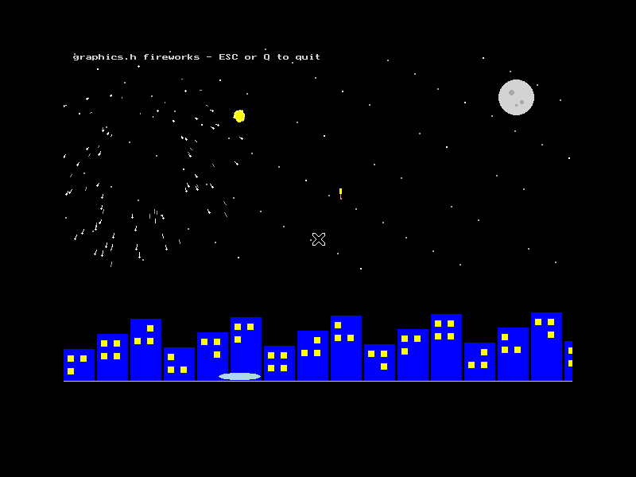

<p align="center">
  
</p>
<h3 align="center">Developed by the Department of CSE, <a href="https://www.diu.ac.bd/">Dhaka International University</a>, Bangladesh</h3>

---

# graphics.h Runner — One-Click Setup

[](https://github.com/mythos0/graphics-h-runner/releases)
[](LICENSE)
[](#per-os-details)
[](#tested-and-verified)

**Compile and run C++ programs that use `graphics.h` (BGI / WinBGIm / SDL_bgi) in VS Code — with one keypress.**
A single command prepares the entire toolchain from scratch: the compiler itself, the graphics
library, the linker flags and the native VS Code run integration. No manual configuration, and no
administrator rights are required for the graphics library.

```cpp
#include <graphics.h>

int main ( ) {
    initwindow(640, 480);
    setcolor(YELLOW);
    setfillstyle(SOLID_FILL, RED);
    bar(80, 80, 280, 200);
    outtextxy(200, 300, (char*)"Hello, graphics.h!");
    getch();
    closegraph();
    return 0;
}
```

Press **`Ctrl+Alt+R`** — the file is compiled with the correct linker flags and the graphics
window opens.



## Features

| Feature | Description |
|---|---|
| **Complete Run Setup** | One command bootstraps everything, including the C++ compiler itself on Windows (winget, or a checksum-verified direct download fallback — per-user, no administrator rights). It then installs WinBGIm/SDL_bgi automatically (download, patch, build, install), re-verifies the full toolchain with a live compile, and wires the native VS Code run options to the same toolchain. |
| **Native VS Code run (F5 / Ctrl+Alt+N / Ctrl+Shift+B)** | After Complete Run Setup, the standard VS Code C++ workflows use the graphics.h toolchain: F5 compiles and runs the open file through the built-in `graphics-h` debug adapter (no extra debugger extensions), Code Runner's Ctrl+Alt+N compiles with the same flags and runs in the terminal with input, Ctrl+Shift+B builds via a default task that routes errors into the Problems panel, and `C_Cpp.default.compilerPath` aligns IntelliSense. All writes are merge-safe and idempotent — your own configurations are preserved. |
| **Six ways to compile & run** | `Ctrl+Alt+R` (compile & run), `Ctrl+Alt+B` (compile), the editor run-button dropdown, F5, Code Runner's Ctrl+Alt+N, and Ctrl+Shift+B — all described in the table below. |
| **graphics.h auto-detection** | When `#include <graphics.h>` is present, the BGI linker flags are applied automatically. Files without it compile as plain C++. |
| **Per-OS linker recipes** | Windows (WinBGIm): `-lbgi -lgdi32 -lcomdlg32 -luuid -loleaut32 -lole32` plus static linking, so the `.exe` runs on any Windows 10/11 PC without extra DLLs. Linux (SDL_bgi): `-lSDL_bgi -lSDL2 -lm`, or libgraph: `-lgraph`. macOS: SDL_bgi via Homebrew SDL2. Custom library prefixes receive a matching `-Wl,-rpath` automatically. |
| **Terminal input & output** | Compiled programs run in the integrated terminal, so `cin` / `scanf` / `getch()` input and `cout` / `printf` output work as expected alongside the graphics window. One persistent terminal is reused for every run, and `Ctrl+Alt+S` stops the running program. |
| **Setup Doctor** | Probes the compiler and every candidate graphics library by actually compiling a `graphics.h` program, then reports precisely what is missing with per-OS fixes and an optional automatic repair. |
| **Compiler errors in the Problems panel** | g++ output is parsed into clickable file:line diagnostics with inline squiggles, so compile errors are visible where you edit. |
| **Status bar indicator** | `✓ graphics.h` / `⚠ graphics.h` at a glance; switches to *Compiling…* and to a click-to-stop control while a program runs. Clicking it when idle runs the Setup Doctor. |
| **Messy-settings healing** | Quoted paths, `%ENV%` / `$VAR` / `~` variables, trailing slashes, directory-instead-of-executable paths, missing `.exe` suffixes and stale include/lib directories from old installs are all recognized and corrected or routed to the one-click fix. |
| **Clean exit** | Before Complete Run Setup changes anything it records your original settings, and **uninstalling the extension restores them automatically** — the Code Runner executor, the F5 launch configuration, the build task and the compiler paths are reverted surgically, leaving your own settings untouched. Updates and normal shutdowns never modify anything. The `graphics.h: Restore Original Settings` command performs the same undo at any time. |
| **Activity-bar panel** | A dashboard with a live Ready / Not ready status pill, a one-click Complete Run Setup button while anything is missing, the full action grid, and all bundled programs as cards with one-click **Run** and **Open** buttons — responsive, and consistent in light and dark themes. |
| **Cheat sheet** | A searchable `graphics.h` function reference with 81 entries across 11 sections — parameters, angle and color conventions, fill patterns, fonts, keyboard codes, mouse events and classic usage patterns for every function. |
| **21 example programs** | The **Game Suite**: Snake (WASD/arrows, bonus apples, a top-5 score database), 2-Player Football (a street-rules derby whose pitch is drawn without a single built-in shape call, charged shots, AI keepers, two halves) and Bounce (the rubber-ball classic — charge jumps, rings, spikes, springs, six levels, synthesized sounds). Plus the **Computer Graphics Lab**, a learn-graphics.h-from-zero-to-advanced course: ten new labs (First Window, Colors & Pixels, Shapes & Text, Keyboard & Mouse, the Animation Loop, Sprites with `getimage`, hand-written Scanline Polygon Fill, animated Bézier Curves, recursive Fractals and a 3-D Wireframe Cube) alongside the eight restored classics (Coordinate Viewer, Pixel Inspector, DDA, Bresenham line & circle, Midpoint Ellipse, 2D Transformations, Cohen–Sutherland Clipping). |
| **Snippets** | `gfxprog`, `gfx-anim`, `gfx-mouse`, `gfx-kbd`, `gfx-text`, `gfx-bar`. |
| **Celebrations** (optional) | A confetti animation over the panel on every successful compilation and a short show when the panel first opens each session; compile errors produce a full-screen error overlay presenting the first error messages. Includes an optional **Fireworks Simulator** with realistic synthesized audio (launch whoosh, burst boom, crackle) and click-to-burst — click anywhere in the show and the next firework bursts at that spot. Everything is bundled locally (no network requests) and can be disabled with `graphics-h-runner.celebrations.enabled`. |

## Installation

**From the VS Code Marketplace (recommended):** search for **"graphics.h Runner"** in the
Extensions view (`Ctrl+Shift+X`), or:

```bash
code --install-extension mythos0-labs.graphics-h-runner
```

**From a GitHub release:** download `graphics-h-runner-<version>.vsix` from
[Releases](../../releases), then in VS Code: `Extensions view → ⋯ → Install from VSIX…`.

## Quick start — from zero to a graphics window

1. Open the Command Palette and run **`graphics.h: Complete graphics.h Run Setup`**.
2. The setup prepares each platform automatically:
   - **Windows** — installs MinGW-w64 g++ via `winget` (a checksum-verified WinLibs download is
     used as a fallback), then downloads `graphics.h`, `winbgim.h` and `libbgi.a` into the
     extension folder and wires the paths. No administrator rights required.
   - **Linux** — prints one copy-paste command for the system packages (`build-essential`,
     `libsdl2-dev`), then automatically downloads, patches, builds and installs SDL_bgi into
     `~/.graphics-h-runner/` — no `sudo` required for the library — and wires the include/lib
     paths into the settings.
   - **macOS** — `xcode-select` and Homebrew SDL2 guidance, then the same automatic user-prefix
     SDL_bgi build.
3. When the setup reports **VERIFIED: graphics.h is ready**, open any `.cpp` file that includes
   `<graphics.h>` and press `Ctrl+Alt+R` — or use F5, Ctrl+Alt+N (Code Runner) or Ctrl+Shift+B.
   The setup has connected all of them to the same toolchain. If you open a different folder
   later, run `graphics.h: Enable native VS Code run` once in that folder.

## Compile & run — six ways

| Method | Key | What it does |
|---|---|---|
| Compile & Run | `Ctrl+Alt+R` | Compiles with the correct BGI flags and runs the program |
| Compile | `Ctrl+Alt+B` | Compiles only |
| Build task | `Ctrl+Shift+B` | Default build task with the same flags; errors appear in the Problems panel |
| Run and Debug | `F5` | Compiles and launches the active file through the built-in `graphics-h` adapter |
| Code Runner | `Ctrl+Alt+N` | Compiles and runs in the terminal with the same flags (configured by Complete Run Setup) |
| Run button dropdown | — | Compile & Run / Compile entries beside the editor's run button |

## Commands

| Command | Description |
|---|---|
| `graphics.h: Compile & Run` | Compile (with BGI flags when needed) and run |
| `graphics.h: Compile` | Compile only |
| `graphics.h: Run Last Build` | Run the previously built binary (recompiles automatically if the source is newer) |
| `graphics.h: Stop Running Program` | Stop the running graphics program (`Ctrl+Alt+S`) |
| `graphics.h: Complete graphics.h Run Setup` | The full bootstrap — compiler, library, verification, native-run wiring |
| `graphics.h: Enable native VS Code run (F5, Ctrl+Alt+N, Ctrl+Shift+B)` | Connect the standard VS Code run paths to the toolchain for the current workspace |
| `graphics.h: Restore Original Settings (undo Complete Run Setup)` | Restore every setting the setup changed — also runs automatically on uninstall |
| `graphics.h: Setup Doctor — Check Environment` | Probe the compiler and graphics libraries, with fixes |
| `graphics.h: Copy Compile Command` | Copy the exact compiler command line for the active file |
| `graphics.h: Open Examples Folder` | Copy all 31 examples into the workspace and reveal them |
| `graphics.h: Open Example Program` | Open any bundled sample in the editor |
| `graphics.h: Cheat Sheet` | Open the searchable `graphics.h` function reference |
| `graphics.h: Fireworks Simulator` | Full-screen fireworks simulation (same button or Esc stops it) |

## The graphics.h panel

The **graphics.h Runner** icon in the Activity Bar opens the panel:

1. **Status** — a live Ready / Not ready / Checking pill with the extension version, and a
   one-click **Complete Run Setup** button while anything is missing.
2. **Actions** — Compile & Run, Complete Run Setup, Setup Doctor, Compile, Run Last Build,
   Stop Running Program, Copy Compile Command and **Reset Setup** (the same surgical restore
   that runs on uninstall, behind a confirmation), always visible.
3. **Example Programs** — the three games as cards with **Run** (open, compile and launch in one
   click) and **Open** (open the source in the editor) buttons, in a scrollable, collapsible
   section.
4. **Computer Graphics Lab** — 18 lab programs arranged from zero to advanced: start-here labs
   (first window, colors, shapes, input, animation), the interactive teaching tools, the classic
   course algorithms, and advanced labs (sprites, scanline fill, Bézier curves, fractals, a 3-D
   cube). Most print step-by-step explanations in the terminal while they draw.
5. **Cheat sheet** — the `?` button in the view title bar opens the searchable function
   reference inside the panel.

## Extension settings

| Setting | Default | Description |
|---|---|---|
| `graphics-h-runner.compilerPath` | `g++` | Compiler executable (full path if not on PATH) |
| `graphics-h-runner.autoDetect` | `true` | Apply BGI flags only when `graphics.h` is detected |
| `graphics-h-runner.linuxLibrary` | `auto` | `auto` / `sdl_bgi` / `libgraph` |
| `graphics-h-runner.staticLinkWindows` | `true` | Statically link the C/C++ runtimes on Windows so the `.exe` runs anywhere |
| `graphics-h-runner.extraIncludePaths` | `[]` | Extra `-I` directories |
| `graphics-h-runner.extraLibPaths` | `[]` | Extra `-L` directories |
| `graphics-h-runner.extraCompilerArgs` | `[]` | Extra compiler arguments, e.g. `["-std=c++17", "-Wall"]` |
| `graphics-h-runner.showStatusBarItem` | `true` | Show the status bar indicator |
| `graphics-h-runner.celebrations.enabled` | `true` | Confetti on compile success, a first-open show per session, and the full-screen error overlay on compile errors |
| `graphics-h-runner.restoreSettingsOnUninstall` | `true` | Restore the settings Complete Run Setup changed when the extension is uninstalled |

## Telemetry

This extension collects **crash and error reports** through [Sentry](https://sentry.io) so that
setup failures on any machine can be diagnosed and fixed without requiring users to collect logs.

- **Consent** — nothing is sent unless VS Code telemetry is enabled (`Settings → Telemetry →
  Telemetry Level` is not `Off`). Changing that setting enables or disables collection
  immediately.
- **Collected** — uncaught exceptions and unhandled rejections from this extension, with stack
  traces, breadcrumbs (for example "compile failed", "Complete Setup step: install-winbgim") and
  tags such as OS, CPU architecture, VS Code version and the detected graphics library.
- **Never collected** — your source code, file contents, compiler output, file names or anything
  you type. User-identifying path segments are scrubbed from every event before it leaves the
  machine.

## Tested and verified

Every bundled sample is compiled with the extension's own flag-building code, executed on a
virtual display and screenshot-verified by an automated pipeline (`test/run-tests.js`; machine-
readable results in `test/test-results.json`). Current results — **31/31 passing**:

| Sample | Verdict | What it renders |
|---|---|---|
| `01_hello_graphics.cpp` | ✅ PASS | basic shapes and text |
| `02_shapes_showcase.cpp` | ✅ PASS | bars, circles, ellipses, flood fill, 16-color palette |
| `03_bouncing_ball.cpp` | ✅ PASS | animated ball with trail |
| `04_moving_car.cpp` | ✅ PASS | scrolling road scene |
| `05_tricolor_flag.cpp` | ✅ PASS | flag with sun emblem |
| `06_fractal_tree.cpp` | ✅ PASS | recursive fractal tree |
| `07_mandelbrot.cpp` | ✅ PASS | full Mandelbrot set (~120k pixels) |
| `08_mouse_paint.cpp` | ✅ PASS | mouse painting with color cycling |
| `09_keyboard_paddle.cpp` | ✅ PASS | paddle game with keyboard control |
| `10_smiley_wink.cpp` | ✅ PASS | animated smiley with blinking eyes |
| `11_bouncing_balls.cpp` | ✅ PASS | seven balls with ghost trails |
| `12_fireworks.cpp` | ✅ PASS | shell-based fireworks over a city skyline |
| `13_solar_system.cpp` | ✅ PASS | orbiting planets, moon and comet |
| `14_aquarium.cpp` | ✅ PASS | fish, bubbles and swaying seaweed |
| `15_rainbow_spiral.cpp` | ✅ PASS | growing rainbow spiral |
| `16_helicopter.cpp` | ✅ PASS | helicopter over a night skyline |
| `17_sunset.cpp` | ✅ PASS | sunset with rising stars and moon |
| `18_starfield.cpp` | ✅ PASS | warp-speed starfield |
| `19_dda_line.cpp` | ✅ PASS | DDA line from terminal input, pixel by pixel |
| `20_turbo_tour.cpp` | ✅ PASS | `bar3d`, `pieslice`, `sector`, fill patterns |
| `21_viewport_bounce.cpp` | ✅ PASS | viewport clipping with two panes |
| `22_sprite_ride.cpp` | ✅ PASS | `getimage`/`putimage` sprite animation |
| `23_conio_paint.cpp` | ✅ PASS | `conio.h` keyboard drawing pad |
| `24_coordinate_viewer.cpp` | ✅ PASS | grid, axes, origin and coordinate labels |
| `25_pixel_inspector.cpp` | ✅ PASS | mouse x/y and color readout |
| `26_dda_lab.cpp` | ✅ PASS | DDA algorithm with step table |
| `27_bresenham_line_lab.cpp` | ✅ PASS | all-integer Bresenham line, all octants |
| `28_bresenham_circle_lab.cpp` | ✅ PASS | midpoint circle with 8-way symmetry |
| `29_midpoint_ellipse_lab.cpp` | ✅ PASS | midpoint ellipse, region 1 / region 2 |
| `30_2d_transforms_lab.cpp` | ✅ PASS | translate / rotate / scale with real matrices |
| `31_cohen_sutherland_clipping.cpp` | ✅ PASS | outcode-based line clipping |

The setup engine is tested end to end as well: fresh SDL_bgi download → patch → build →
user-prefix install → compile → verified render.

More rendered output: [`docs/screenshots/`](docs/screenshots/)





## Per-OS details

### Windows

1. **Compiler** — Complete Setup installs MinGW-w64 g++ via `winget`
   (`BrechtSanders.WinLibs.POSIX.UCRT`, per-user, no administrator prompt) and wires it into
   `graphics-h-runner.compilerPath`. Without winget, it downloads the WinLibs UCRT archive
   directly (sha256-verified) and extracts it with built-in PowerShell. Manual route:
   [winlibs.com](https://winlibs.com/). The setup also detects incompatible 32-bit compilers
   (for example legacy MinGW.org 6.3.0, which cannot link the 64-bit graphics library) and
   replaces them with a compatible 64-bit toolchain automatically.
2. **WinBGIm** — downloaded into the extension folder automatically. Manual route: copy
   `graphics.h` + `winbgim.h` into `<MinGW>\include` and `libbgi.a` into `<MinGW>\lib`.
3. **Compile command** —
   `g++ main.cpp -o main.exe -static -lbgi -lgdi32 -lcomdlg32 -luuid -loleaut32 -lole32 -static-libgcc -static-libstdc++`
   (fully static — the `.exe` runs on any Windows 10/11 machine).

### Linux

1. `sudo apt install build-essential libsdl2-dev` (or the `dnf` / `pacman` equivalents — Complete
   Setup detects your package manager).
2. **SDL_bgi** — downloaded, patched, built and installed into `~/.graphics-h-runner/usr/`
   automatically (no `sudo`). Manual route: build from
   [sourceforge.net/projects/sdl-bgi](https://sourceforge.net/projects/sdl-bgi/).
3. **Compile command** — `g++ main.cpp -o main -lSDL_bgi -lSDL2 -lm`
4. *Tip:* if a self-installed SDL_bgi 3.x shows a black window, set `SDL_BGI_RATE=auto` or call
   `refresh()` after drawing — Complete Setup's build already includes the fix.

### macOS

1. `xcode-select --install`, then `brew install sdl2`.
2. **SDL_bgi** — the same automatic user-prefix build as Linux.

## Troubleshooting

- **"could not run g++"** — install a compiler (see per-OS details above) or set
  `graphics-h-runner.compilerPath` to its full path.
- **The Doctor reports a failed library probe** — read the printed fix, or choose
  **Fix automatically**.
- **Black window on a self-installed SDL_bgi 3.x** — set `SDL_BGI_RATE=auto`, or re-run Complete
  Setup to install the patched build.
- **`winget` missing on Windows** — use the WinLibs download that Complete Setup offers.
- **`undefined reference to 'circle' / 'getmaxx' / …` at link time** — the compiler cannot use
  the installed graphics library. The bundled WinBGIm is 64-bit; the legacy 32-bit MinGW.org g++
  silently skips it. Re-run **Complete Run Setup**, which detects the incompatibility and
  installs a compatible 64-bit compiler automatically.
- **The full-screen error overlay appears on a failed build** — it shows the first compiler
  error messages so the failure explains itself; click or press Esc to dismiss it instantly.

## Development

```bash
git clone https://github.com/mythos0/graphics-h-runner.git
cd graphics-h-runner
npm install && npm run compile
npx @vscode/vsce package --no-dependencies
code --install-extension graphics-h-runner-*.vsix
```

The test suites live in `test/` — unit tests for the pure modules, a screenshot-verified sample
pipeline (`run-tests.js`) and real-host end-to-end tests that exercise activation, the native run
integration and the uninstall restore in a live VS Code instance.

## License

[MIT](LICENSE)
